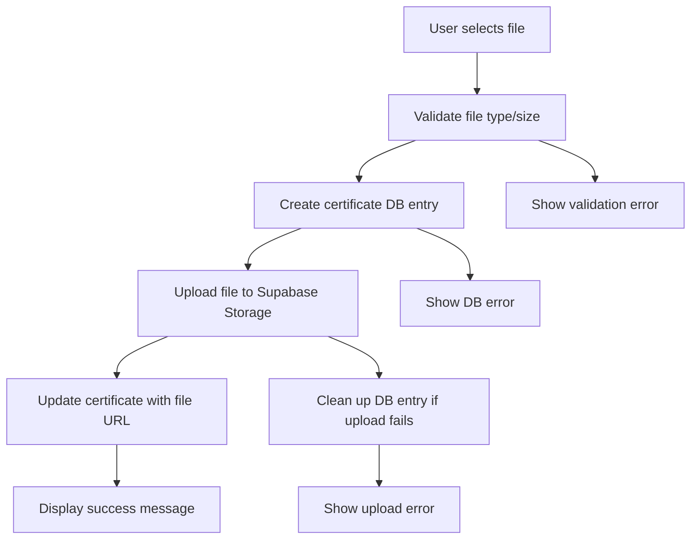

# Certificate Upload System Setup Guide

This guide will help you set up the complete certificate upload system with Supabase storage integration.

## 🚀 Quick Setup Steps

### 1. Database Setup

Run these SQL files in your Supabase SQL Editor in this order:

```sql
-- First, run the enhanced schema (if not done already)
\include database/enhanced-schema.sql

-- Then, run the storage setup
\include database/storage-setup.sql
```

### 2. Environment Variables

Ensure your `.env.local` has the correct Supabase credentials:

```env
NEXT_PUBLIC_SUPABASE_URL=your_supabase_url
NEXT_PUBLIC_SUPABASE_ANON_KEY=your_supabase_anon_key
```

### 3. Test the System

1. Start your development server: `npm run dev`
2. Navigate to `/certificates` to test the certificate manager
3. Try uploading a certificate with a PDF/image file

## 📁 File Structure

```
components/
  certificates/
    certificate-manager.tsx         # Main certificate management interface
  portfolio/
    certificate-upload-dialog.tsx   # Enhanced upload dialog
lib/
  storage.ts                       # Enhanced storage service
  certificate-service.ts           # Enhanced certificate service
  types.ts                        # Updated type definitions
app/
  certificates/
    page.tsx                       # Certificates page
database/
  storage-setup.sql               # Storage bucket and policy setup
```

## 🔧 Key Features Implemented

### Certificate Upload System

- ✅ **File Upload to Supabase Storage** - Supports PDF, JPEG, PNG files
- ✅ **File Validation** - Type and size validation (5MB limit)
- ✅ **Unique File Naming** - Prevents conflicts with timestamp + random ID
- ✅ **Database Integration** - Links uploaded files to certificate records
- ✅ **Error Handling** - Comprehensive error messages and rollback

### Certificate Management

- ✅ **Visual Certificate Cards** - Display all certificate information
- ✅ **Status Tracking** - Pending, Verified, Rejected status badges
- ✅ **Category Organization** - Academic, Professional, Skill, Achievement
- ✅ **Search Functionality** - Search by title or issuer
- ✅ **Statistics Dashboard** - Quick overview of certificate counts
- ✅ **File Access** - View uploaded certificate files
- ✅ **Delete Functionality** - Remove certificates and associated files

### Storage Security

- ✅ **Row Level Security** - Students can only access their own files
- ✅ **Faculty Access** - Faculty can view all certificates for review
- ✅ **Public Access** - Verified certificates are publicly viewable
- ✅ **File Organization** - Files organized by student ID folders

## 🎯 Usage Examples

### Basic Certificate Upload

```tsx
import { CertificateManager } from "@/components/certificates/certificate-manager";

export default function StudentDashboard() {
  return (
    <div>
      <h1>My Certificates</h1>
      <CertificateManager />
    </div>
  );
}
```

### Upload with File

```tsx
const certificateData = {
  student_id: "student-uuid",
  title: "Google UX Design Certificate",
  issuer: "Google (via Coursera)",
  issue_date: "2023-12-15",
  category: "professional"
}

const file = new File([...], "certificate.pdf", { type: "application/pdf" })

const { certificate, error } = await certificateService.uploadCertificateWithFile(
  certificateData,
  file
)
```

### Get Student Certificates

```tsx
const certificates = await certificateService.getCertificatesByStudent(
  studentId
);
```

## 🔒 Security Features

### Storage Policies

- **Students** can upload/view/delete only their own certificate files
- **Faculty** can view all certificate files for review purposes
- **Admin** has full access to all files
- **Public** can view files for verified certificates only

### File Validation

- **Type checking**: Only PDF, JPEG, PNG files allowed
- **Size limits**: Maximum 5MB per file
- **Name sanitization**: Special characters removed from filenames
- **Unique naming**: Prevents file conflicts with timestamps and random IDs

### Database Security

- **RLS enabled** on all certificate-related tables
- **Foreign key constraints** ensure data integrity
- **Cascade deletes** clean up associated files when certificates are deleted

## 🐛 Troubleshooting

### Common Issues

1. **"Bucket not found" error**

   - Run the `storage-setup.sql` script
   - Check that buckets are created in Supabase dashboard

2. **"Upload failed: Permission denied"**

   - Verify RLS policies are applied correctly
   - Check that user has proper student/faculty role

3. **"File not found" when viewing certificates**

   - Ensure storage policies allow public read access
   - Check that file paths are stored correctly in database

4. **TypeScript errors**
   - Run `npm run build` to check for type issues
   - Ensure all imports are correctly specified

### Debug Commands

```bash
# Check if storage buckets exist
# Run in Supabase SQL Editor:
SELECT * FROM storage.buckets WHERE id IN ('certificates', 'avatars');

# Check storage policies
SELECT * FROM pg_policies WHERE tablename = 'objects';

# Test file upload manually
# Use Supabase dashboard Storage section
```

## 🔄 Next Steps

1. **AI Integration**: Add automatic skill extraction from certificate text
2. **Batch Upload**: Allow multiple file uploads at once
3. **File Preview**: Add in-app PDF/image preview
4. **Version Control**: Track certificate updates and versions
5. **Analytics**: Add certificate upload/verification metrics

## 📊 File Upload Flow



The certificate upload system is now fully functional with Supabase storage integration! 🎉
